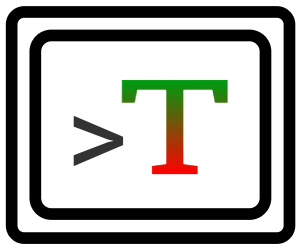

#  Contest client for VSCode

### install

This extension is
[available](https://marketplace.visualstudio.com/items?itemName=kevgo.contest-vscode)
in the Visual Studio marketplace. Please don't forget to also install the

[server](https://github.com/contest/server).

### use

1. Arrange a terminal and VSCode on your screen(s) so that you see both. You can
   use the terminal built into VSCode or an external one here.
2. Start the server by running `contest` in that terminal.
3. Open Visual Studio's command palette by pressing (`Ctrl-Shift-P` or
   `Cmd-Shift-P`). Enter `contest` to trim the list of available commands.
   Choose one of these commands:

<table type="commands">
  <tr>
    <td><b>all-once</b></td>
    <td>Test everything</td>
  </tr>
  <tr>
    <td><b>all-on-save</b></td>
    <td>Test everything on save</td>
  </tr>
  <tr>
    <td><b>all-on-double-save</b></td>
    <td>Test everything on double-save</td>
  </tr>
  <tr>
    <td><b>this-file-once</b></td>
    <td>Test this file</td>
  </tr>
  <tr>
    <td><b>this-file-on-save</b></td>
    <td>Test this file on save</td>
  </tr>
  <tr>
    <td><b>this-file-on-double-save</b></td>
    <td>Test this file on double-save</td>
  </tr>
  <tr>
    <td><b>this-line-once</b></td>
    <td>Test this line in this file</td>
  </tr>
  <tr>
    <td><b>this-line-on-save</b></td>
    <td>Test this line in this file on save</td>
  </tr>
  <tr>
    <td><b>this-line-on-double-save</b></td>
    <td>Test this line in this file on double-save</td>
  </tr>
  <tr>
    <td><b>current-file-on-save</b></td>
    <td>Test the active file on save</td>
  </tr>
  <tr>
    <td><b>current-file-on-double-save</b></td>
    <td>Test the active file on double-save</td>
  </tr>
  <tr>
    <td><b>repeat-once</b></td>
    <td>Repeat the last test</td>
  </tr>
  <tr>
    <td><b>repeat-on-save</b></td>
    <td>Start/Stop repeat the last test on save</td>
  </tr>
  <tr>
    <td><b>repeat-on-double-save</b></td>
    <td>Start/Stop repeat the last test on double-save</td>
  </tr>
  <tr>
    <td><b>stop</b></td>
    <td>Stop the current test</td>
  </tr>
  <tr>
    <td><b>quit</b></td>
    <td>Quit the Contest server</td>
  </tr>
</table>

### develop

See the [developer guide](DEVELOPMENT.md).
